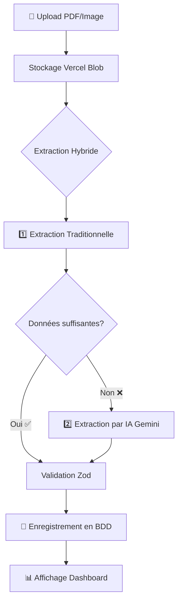
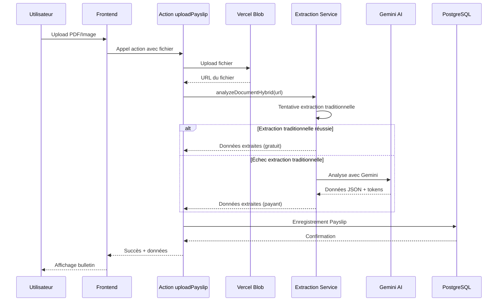

# Système d'OCR et de Reconnaissance par IA - PaiePro

## Vue d'ensemble

PaiePro utilise une **approche hybride** pour extraire les données des bulletins de paie :

1. **Extraction Traditionnelle** (OCR classique avec regex) - Gratuit et rapide
2. **Extraction par IA** (Google Gemini 2.5 Flash) - Précis et intelligent

Le système tente d'abord l'extraction traditionnelle, et si celle-ci échoue ou retourne des données insuffisantes, il bascule automatiquement sur l'IA.

---

## Architecture du Système



---

## 1️⃣ Extraction Traditionnelle (OCR Classique)

### Fichier source
[lib/extraction-service.ts](file:///c:/Users/Mike/Documents/paiepro/lib/extraction-service.ts)

### Fonctionnement

Cette méthode utilise **pdf-parse** pour extraire le texte brut du PDF, puis applique des **expressions régulières (regex)** pour identifier les champs.

#### Étapes du processus

1. **Téléchargement du fichier** depuis Vercel Blob
2. **Extraction du texte brut** avec `pdf-parse`
3. **Application de regex** pour trouver les valeurs

#### Patterns Regex utilisés

```typescript
const patterns = {
    employeeName: /(?:NOM|SALARIÉ|DESTINATAIRE)\s*[:\s]*([A-ZÀ-Ÿ\s]+)/i,
    employerName: /(?:EMPLOYEUR|RAISON\s+SOCIALE)\s*[:\s]*([A-ZÀ-Ÿ0-9\s.-]+)/i,
    netToPay: /(?:NET\s+À\s+PAYER|NET\s+A\s+PAYER)\s*[:\s]*([\d\s,.]+(?:€|EUR)?)/i,
    netBeforeTax: /(?:NET\s+PAYER\s+AVANT\s+IMPÔT|NET\s+AVANT\s+PAS)\s*[:\s]*([\d\s,.]+)/i,
    netTaxable: /(?:NET\s+IMPOSABLE|CUMUL\s+IMPOSABLE)\s*[:\s]*([\d\s,.]+)/i,
    grossSalary: /(?:SALAIRE\s+BRUT|TOTAL\s+BRUT)\s*[:\s]*([\d\s,.]+)/i,
    taxAmount: /(?:IMPÔT\s+SUR\s+LE\s+REVENU|P\.A\.S)\s*[:\s]*([\d\s,.]+)/i,
    hoursWorked: /(?:HEURES?\s+TRAVAILLÉES?|TOTAL\s+HEURES?)\s*[:\s]*([\d\s,.]+)/i,
    siretNumber: /(?:SIRET|N°\s+SIRET)\s*[:\s]*(\d{14})/i,
    urssafNumber: /(?:URSSAF|N°\s+URSSAF)\s*[:\s]*([A-Z0-9\s]+)/i
};
```

#### Avantages
- ✅ **Gratuit** (pas de coût API)
- ✅ **Rapide** (quelques millisecondes)
- ✅ **Fonctionne hors ligne**

#### Limitations
- ❌ Dépend du format exact du bulletin
- ❌ Sensible aux variations de mise en page
- ❌ Ne gère pas les PDF scannés (images)
- ❌ Nécessite des patterns précis

---

## 2️⃣ Extraction par IA (Google Gemini)

### Fichier source
[lib/ai-service.ts](file:///c:/Users/Mike/Documents/paiepro/lib/ai-service.ts)

### Modèle utilisé
**Gemini 2.5 Flash** - Le modèle le plus récent et performant de Google

### Fonctionnement

L'IA utilise la **vision multimodale** pour analyser directement le document (PDF ou image) sans extraction de texte préalable.

#### Étapes du processus

1. **Téléchargement du fichier** depuis Vercel Blob
2. **Conversion en Base64** pour l'envoi à l'API
3. **Envoi au modèle Gemini** avec un prompt système spécialisé
4. **Réception de la réponse JSON**
5. **Validation avec Zod** pour garantir la structure

#### Prompt système

Le prompt système est crucial pour guider l'IA :

```typescript
const SYSTEM_PROMPT = `Tu es un expert en extraction de données de bulletins de paie français (modèle 2024 inclus).
Analyse le document fourni et extrais UNIQUEMENT les informations suivantes au format JSON strict :

{
  "employeeName": "NOM Prénom (ex: M. BICHE Arnaud)",
  "employeeAddress": "Adresse complète",
  "employerName": "Raison sociale employeur",
  "siretNumber": "SIRET (14 chiffres)",
  "urssafNumber": "N° URSSAF ou Compte Employeur",
  "periodMonth": 1-12,
  "periodYear": YYYY,
  "netToPay": 1234.56,
  "netBeforeTax": 1300.00,
  "netTaxable": 1350.00,
  "grossSalary": 1800.00,
  "taxAmount": 50.00,
  "hoursWorked": 151.67,
  "hourlyNetTaxable": 15.00
}

CONSIGNES CRITIQUES :
- PÉRIODE : Identifie la période de paie dans l'en-tête. IGNORE les dates de signature.
- NET À PAYER : C'est le montant final viré sur le compte.
- NET FISCAL : Cherche "Net Social Fiscal" ou "Net Imposable".
- SIRET : Cherche un numéro de 14 chiffres.
- RÈGLE : Réponds UNIQUEMENT avec le JSON pur. Si une donnée est absente, mets null.`;
```

#### Configuration du modèle

```typescript
const model = genAI.getGenerativeModel({
    model: 'gemini-2.5-flash',
    generationConfig: {
        temperature: 0.1,        // Très faible pour des réponses déterministes
        maxOutputTokens: 2048,   // Limite de tokens en sortie
        responseMimeType: 'application/json' // Force le format JSON
    }
});
```

#### Avantages
- ✅ **Très précis** (comprend le contexte)
- ✅ **Gère tous les formats** (PDF, images, scans)
- ✅ **Robuste aux variations** de mise en page
- ✅ **Comprend le français** naturellement
- ✅ **Vision multimodale** (analyse l'image directement)

#### Limitations
- ❌ **Coût API** (environ 0.001€ par analyse)
- ❌ **Latence** (1-3 secondes)
- ❌ **Dépend d'internet**

---

## Champs Extraits

Voici les **13 champs** que le système extrait de chaque bulletin de paie :

| Champ | Type | Description | Exemple |
|-------|------|-------------|---------|
| `employeeName` | String | Nom complet du salarié | "M. DUPONT Jean" |
| `employeeAddress` | String | Adresse du salarié | "12 Rue de la Paix, 75001 Paris" |
| `employerName` | String | Raison sociale de l'employeur | "ACME CORP" |
| `siretNumber` | String | Numéro SIRET (14 chiffres) | "12345678901234" |
| `urssafNumber` | String | Numéro URSSAF | "URSSAF123456" |
| `periodMonth` | Number | Mois de la période (1-12) | 3 |
| `periodYear` | Number | Année de la période | 2024 |
| `netToPay` | Number | Net à payer (après impôts) | 1850.50 |
| `netBeforeTax` | Number | Net avant impôts | 1900.00 |
| `netTaxable` | Number | Net imposable (base fiscale) | 2000.00 |
| `grossSalary` | Number | Salaire brut | 2500.00 |
| `taxAmount` | Number | Montant de l'impôt prélevé | 49.50 |
| `hoursWorked` | Number | Heures travaillées | 151.67 |
| `hourlyNetTaxable` | Number | Taux horaire net imposable | 13.18 |

---

## Validation des Données

### Fichier source
[lib/validations.ts](file:///c:/Users/Mike/Documents/paiepro/lib/validations.ts)

Toutes les données extraites sont **validées avec Zod** pour garantir leur cohérence :

```typescript
export const aiExtractedDataSchema = z.object({
    employeeName: z.string().min(1).max(255).optional().nullable(),
    employerName: z.string().min(1).max(255).optional().nullable(),
    periodMonth: z.number().int().min(1).max(12).optional().nullable(),
    periodYear: z.number().int().min(2000).max(2100).optional().nullable(),
    netToPay: z.number().nonnegative(),
    netBeforeTax: z.number().nonnegative(),
    netTaxable: z.number().nonnegative(),
    grossSalary: z.number().nonnegative(),
    taxAmount: z.number().nonnegative(),
    hoursWorked: z.number().nonnegative().max(744), // Max 31 jours × 24h
    hourlyNetTaxable: z.number().nonnegative(),
    employeeAddress: z.string().optional().nullable(),
    siretNumber: z.string().optional().nullable(),
    urssafNumber: z.string().optional().nullable()
});
```

### Règles de validation
- Les montants doivent être **positifs ou nuls**
- Le mois doit être entre **1 et 12**
- L'année doit être entre **2000 et 2100**
- Les heures travaillées ne peuvent pas dépasser **744h** (31 jours × 24h)

---

## Flux Complet de Traitement

### Fichier source
[app/actions/payslip.ts](file:///c:/Users/Mike/Documents/paiepro/app/actions/payslip.ts)



---

## Métriques et Suivi

### Tokens utilisés

Le système enregistre le nombre de **tokens consommés** par l'IA :

- `inputTokens` : Nombre de tokens envoyés (document + prompt)
- `outputTokens` : Nombre de tokens reçus (réponse JSON)

Ces métriques permettent de :
- 📊 Suivre les coûts d'utilisation de l'API
- 📈 Analyser les performances
- 💰 Optimiser le prompt pour réduire les coûts

### Modèle utilisé

Le champ `aiModel` indique quelle méthode a été utilisée :
- `"gemini-2.5-flash"` : Extraction par IA
- `"Extraction Traditionnelle ⚙️"` : Extraction par regex

---

## Gestion des Erreurs

### Retry avec backoff exponentiel

Si l'API Gemini échoue, le système réessaye automatiquement avec un délai croissant :

```typescript
export async function analyzeDocumentWithRetry(
    fileUrl: string,
    maxRetries = 3
): Promise<AIExtractedData> {
    for (let attempt = 1; attempt <= maxRetries; attempt++) {
        try {
            return await analyzeDocument(fileUrl);
        } catch (error) {
            if (attempt < maxRetries) {
                // Backoff exponentiel: 2^attempt secondes
                await new Promise(resolve => 
                    setTimeout(resolve, Math.pow(2, attempt) * 1000)
                );
            }
        }
    }
}
```

**Délais de retry :**
- Tentative 1 : Immédiat
- Tentative 2 : Après 2 secondes
- Tentative 3 : Après 4 secondes
- Tentative 4 : Après 8 secondes

---

## Optimisations

### 1. Compression des images
Les images sont compressées avant upload pour réduire :
- La taille de stockage
- Le temps de transfert
- Le coût des tokens (moins de données à analyser)

### 2. Format JSON forcé
Le paramètre `responseMimeType: 'application/json'` force Gemini à retourner du JSON valide, évitant les erreurs de parsing.

### 3. Température basse
`temperature: 0.1` garantit des réponses **déterministes** et **cohérentes** (pas de créativité).

---

## Coûts Estimés

### Gemini 2.5 Flash (tarifs Google)
- **Input** : ~0.075$ / 1M tokens
- **Output** : ~0.30$ / 1M tokens

### Estimation par bulletin
- Input : ~1000 tokens (document + prompt)
- Output : ~200 tokens (JSON)
- **Coût total** : ~0.001€ par analyse

### Économies avec l'approche hybride
Si 30% des bulletins sont traités en mode traditionnel :
- **Économie** : 30% des coûts API
- **Rapidité** : 30% des analyses instantanées

---

## Résumé

Le système d'OCR et de reconnaissance par IA de PaiePro combine :

1. **Intelligence** : Utilise Gemini 2.5 Flash pour une précision maximale
2. **Efficacité** : Tente d'abord l'extraction gratuite par regex
3. **Robustesse** : Retry automatique en cas d'erreur
4. **Validation** : Vérification stricte avec Zod
5. **Traçabilité** : Enregistrement des tokens et du modèle utilisé

Cette approche garantit un **taux de réussite élevé** tout en **optimisant les coûts**.
